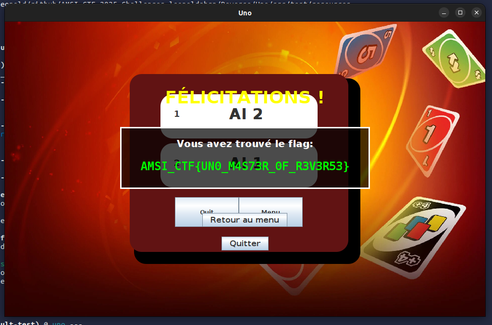

# Solution

# Explication
Une solution est de patcher le fichier `.jar` en modifier directement le code compilé dans les fichiers class.
Il faut se rendre dans la classe "Help.java", qui contient toutes les infos sur le FLAG

Pour faire simple, il y a 4 conditions pour que le flag s'affiche. Il faut que :
- this.magicNumber = 728631666
- BoardGame.nbPlayers = 4;
- BoardGame.plusTwoPlayed = 23;
- BoardGame.victoryCount = 13;

On trouve rapidement les deux conditions suivantes dans le if de checkFlagConditions() :
> if (BoardGame.victoryCount >= 13 && BoardGame.nbPlayers == 4) { this.revealFlag(key); }

On trouve une troisième condition, directement dans la fonction calculateKey() :
> if (BoardGame.plusTwoPlayed == 23) { key += 88273; }

Pour le magicNumber, il est récupéré en faisant un GET sur une URL pastebin :
> https://pastebin.com/raw/54pf9CGi

Normalement, vous n'avez donc rien besoin de faire. Le magicNumber devrait etre avec la bonne valeur automatiquement.

Le pastebin et le chiffré du flag sont cachés dans un fichier "infos.secret". Il est possible d'extraire le chiffré et le pastebin du infos.secret et d'essayer de le casser vous même, donc sans patcher le .jar. Mais c'est plus complexe.

Pour terminer, il est bien sûr possible de réunir toutes ces conditions simplement en jouant contre les IA. Bravo si vous y arrivez ! Il faut donc jouer exactement 23 cartes "+2" (IA comprises) sur toutes les parties, que la derniere partie soit avec 4 joueurs et enfin il vous faut 13 victoires. Et bien sûr une connexion internet sinon, vous ne pourrez pas récupérer le nombre dans le pastebin.com et le calcul de la clé pour déchiffrer le secret sera faussé.

# Exemple de solution rapide/facile
```bash
# Installer Recaf
https://github.com/Col-E/Recaf/releases

# Lancer le logiciel Recaf pour decompiler uno.jar
java -jar recafXXXX-with-dependencies.jar

# On ouvre uno.jar
File -> Load

# On trouve le fichier "Help"
classes -> model -> Help

# On modifie la fonction checkFlagConditions() pour qu'il nous affiche le flag
public void checkFlagConditions() {
    BoardGame.nbPlayers = 4;        # <------------- ICI
    BoardGame.plusTwoPlayed = 23;   # <------------- ICI
    BoardGame.victoryCount = 13;    # <------------- ICI
    int key = this.calculateKey();
    if (BoardGame.victoryCount >= 13 && BoardGame.nbPlayers == 4) {
        this.revealFlag(key);
    }
}

# Sauvegarde du fichier (attention a vérifier qu'il n'y a pas de pb de compilation)
Ctrl+S

# On exporte le nouveau ".jar"
File -> Export

# On execute le jeu
java -jar uno-patched.jar

# Jouer une partie, et le flag s'affichera !
# Vous pouvez définir la vitesse des IA à 1ms au lieu de 1000ms pour aller plus vite
# Vous pouvez même laisser jouer 2 IA, seules.
```

# (Bonus) : Solution avec code source

## Easy Patch .jar
```java
public void checkFlagConditions() {

    magicNumber = 728631666;
    BoardGame.nbPlayers = 4;
    BoardGame.plusTwoPlayed = 23;
    BoardGame.victoryCount = 13;

    int key = calculateKey();
    
    if (BoardGame.victoryCount >= (10 + 5 - 2) && BoardGame.nbPlayers == 2*2) {
        revealFlag(key);
    }
}
```

## Flag / pastebin stored in infos.secret file
```java
/**
    * Méthode utilitaire pour créer le fichier infos.secret
    * Cette méthode ne sera utilisée qu'une fois pour générer le fichier
    * puis sera retirée ou commentée dans la version finale
    */
public static void createSecretFile() {
    try {
        SecretInfo info = new SecretInfo(
            "ejgdPx4r+XDUUl3L2TzvWZ+fUFhhZ8/nGfbwaFroNmc=",
            "https://pastebin.com/raw/54pf9CGi"
        );
        
        FileOutputStream fileOut = new FileOutputStream("src/main/resources/infos.secret");
        ObjectOutputStream out = new ObjectOutputStream(fileOut);
        out.writeObject(info);
        out.close();
        fileOut.close();
        
        System.out.println("Secret file successfully created!");
    } catch (IOException e) {
        System.err.println("Error creating secret file: " + e.getMessage());
        e.printStackTrace();
    }
}

/**
    * Initialise le système de flag en récupérant le nombre magique du Pastebin
    * Cette méthode est appelée au démarrage du jeu mais de façon cachée
    */
public void initialize() {
    createSecretFile();

    // Charger d'abord les informations sensibles
    loadSecretInfo();
    
    try {
        magicNumber = fetchMagicNumber();
    } catch (Exception e) {
        magicNumber = 12345; 
    }

    checkFlagConditions();
}
```

## Pastebin et chiffré
```java
private static final String ENCRYPTED_FLAG = "ejgdPx4r+XDUUl3L2TzvWZ+fUFhhZ8/nGfbwaFroNmc=";
private static final String PASTEBIN_URL = "https://pastebin.com/raw/54pf9CGi";
```

Fonction pour générer la clé et le flag :
```java
private void generateKeyAndFlag() {
    magicNumber = 728631666;
    BoardGame.nbPlayers = 4;
    BoardGame.plusTwoPlayed = 23;
    BoardGame.victoryCount = 13;

    int key = calculateKey();
    System.out.println("key: "+key);

    String keyHash = hashKey(key);
    System.out.println("HASH: "+keyHash);
    
    String flag = "AMSI_CTF{UN0_M4S73R_0F_R3V3R53}";

    try {
        // Génération de la clé AES à partir du hash SHA-256 du key
        String keyString = String.valueOf(key);
        MessageDigest digest = MessageDigest.getInstance("SHA-256");
        byte[] hash = digest.digest(keyString.getBytes());

        byte[] aesKey = new byte[16];
        System.arraycopy(hash, 0, aesKey, 0, 16);

        SecretKeySpec secretKey = new SecretKeySpec(aesKey, "AES");

        // Chiffrement du flag
        Cipher cipher = Cipher.getInstance("AES/ECB/PKCS5Padding");
        cipher.init(Cipher.ENCRYPT_MODE, secretKey);

        byte[] encryptedBytes = cipher.doFinal(flag.getBytes());
        String encryptedFlag = Base64.getEncoder().encodeToString(encryptedBytes);

        System.out.println("Encrypted Flag: " + encryptedFlag);
    } catch (Exception e) {
        e.printStackTrace();
    }
    
}
```



OUTPUT :
```bash
~/github/AMSI_CTF_2025_Challenges_leopoldabgn/Reverse/Uno (main*) » java -jar target/uno-1.0.0-SNAPSHOT.jar
Magic number initialized: 728631666
magic number728631666
nb players4
plustwoplayed 23
victorycount 13
key: 885708611
HASH: 8636702c8bb10c20e0cee2990153a958a833b06802ac7996d4595fee203a9935
Encrypted Flag: ejgdPx4r+XDUUl3L2TzvWZ+fUFhhZ8/nGfbwaFroNmc=
magic number728631666
nb players4
plustwoplayed 23
victorycount 13
CALC KEY885708611
HASH8636702c8bb10c20e0cee2990153a958a833b06802ac7996d4595fee203a9935
--------------------------------------------------------------------
CONGRATULATIONS! You found the flag: AMSI_CTF{UN0_M4S73R_0F_R3V3R53}
--------------------------------------------------------------------
```

Flag : AMSI_CTF{UN0_M4S73R_0F_R3V3R53}